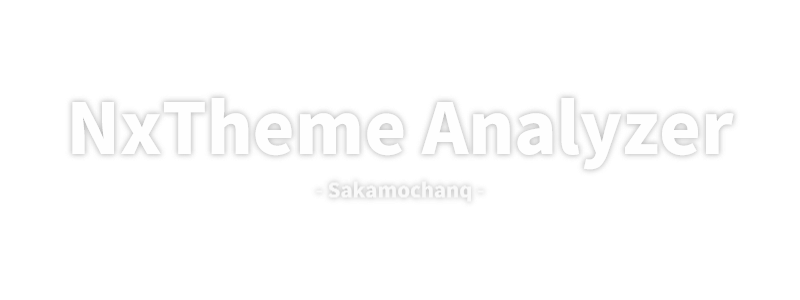

<div align="center">
    <a href="#">
        
    </a>
    <hr>
</div>

<br>

### How to use

Nintendo Switchのカスタムテーマファイル `(*.nxtheme)` から内部情報を取得します。Yaz0圧縮を解答しSARCから`info.json`を取り出してます。NxThemeのビルドバージョンによってYaz0の先頭アドレスが違うみたいで、現状解析できるNxThemeが限られています。また、簡単に作ってみたのでその他バグが多いでしょう。のちこれらを修正していきます。

> [任意のバージョンでダウンロード](https://github.com/Sakamochanq/nxtheme-analyzer/releases)

<br>

<div align="center">
    <a href="#">
        
    </a>
</div>

<br>
<hr>
<br>

### Build

<br>

```bash
git clone https://github.com/Sakamochanq/nxtheme-analyzer.git
cd nxtheme-analyzer/src
```

<br>

Visual Studioから `*.sln` を開き Build を行ってください。

<br>
<hr>
<br>

### License

Release under the [MIT](./LICENSE) LICENSE

<br>

### Author

[Sakamochanq](https://github.com/Sakamochanq)
